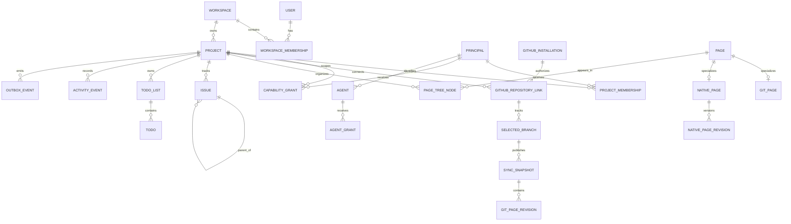

# Folio Domain and Database Model

## Conventions

- PostgreSQL is authoritative in development and production. The legacy SQLite database is import-only.
- IDs are UUIDv7. Timestamps are UTC `timestamptz`; date-only values use `date` plus an explicit time-zone context where needed.
- Mutable aggregates have `revision bigint`, `created_at`, `updated_at`, and normally `archived_at`. Revision increments exactly once per successful command.
- All tenant rows include `workspace_id`; project aggregates also include `project_id`.
- Foreign keys are restrictive by default. Owned, reconstructible children may cascade; authoritative history does not.
- Activity and audit records are append-only. Search, render, link, and provider projections are rebuildable.
- JSONB is used for versioned structured content and bounded metadata, not to avoid relational constraints.

## Entity relationship model

## Identity, tenancy, and authorization

- `users`: Folio profile and lifecycle; no provider password material.
- `external_identities`: provider, provider subject, verified claims summary, last authentication.
- `principals`: common actor identity with kind `human`, `agent`, `api_client`, `worker`, or `system`; human principals reference users.
- `workspaces`: name, slug, plan/status, default time zone, retention policy, revision.
- `workspace_memberships`: user/principal, workspace role, state, invitation provenance.
- `projects`: workspace, key, name, status, time zone, default workflow, default Git write policy, revision, archived state.
- `project_memberships`: principal, project, role-template ID, membership state.
- `role_templates`: workspace/project scope, name, immutable capability set version.
- `capability_grants`: principal, capability, scope type/ID, allow/deny, constraints JSON, grantor, validity interval, revision.
- `object_grants`: principal, object type/ID, capability set, grantor, expiry. Deny and project suspension override allows.

## GitHub integration and synchronization

- `github_installations`: GitHub installation/account IDs, state, encrypted credential reference, permission snapshot, suspension and refresh metadata.
- `github_webhook_deliveries`: delivery ID, event/action, installation ID, signature-verified flag, redacted payload/object reference, received/processed state. Delivery ID is unique.
- `github_repositories`: provider repository/node IDs, owner/name, visibility, default branch, archived state, last provider observation.
- `project_repository_links`: project, installation, repository, read scope, write policy (`disabled`, `pull_request_only`, `direct_allowed`), permitted-path rules, revision.
- `selected_branches`: project repository link, branch name, provider ref/node ID, enabled state, last published snapshot/head.
- `sync_requests`: selected branch, trigger, requested principal, deduplication key, state, attempt summary.
- `sync_snapshots`: selected branch, exact head commit, candidate/published/failed state, parser/index versions, counts, start/finish/published timestamps. Only one active published snapshot per selected branch.
- `sync_file_results`: snapshot, path, blob, size, classification, page ID, warning/error code.
- `prepared_git_changes`: project/repository, base branch/head, target branch, normalized file operations, diff digest, authorizing chain, expiry, state, revision.
- `git_operations`: prepared change, provider commit/ref/PR identifiers, state, attempts, idempotency key, result/error summary.

## Pages and knowledge

- `pages`: stable project identity, source type `git` or `native`, effective title, lifecycle, revision.
- `git_pages`: page ID, project repository link, selected branch ID, normalized path. Live uniqueness is `(project_repository_link_id, selected_branch_id, normalized_path)`.
- `git_page_revisions`: page, sync snapshot, commit/blob IDs, Markdown object/cache reference, content hash, author provenance, rendered/extracted cache versions.
- `native_pages`: page ID, current revision ID, editor schema version.
- `native_page_revisions`: page, sequence/revision, structured content JSONB, plain text, content hash, author principal, parent revision, created time. Revisions are immutable.
- `page_tree_nodes`: project, parent node, page ID or structural folder, rank, display title override, archived state. Moving a node never changes Git provenance.
- `page_links`: source page/revision, target page or external target, link type, source location, resolution/stale state.
- `page_comments`, `comment_threads`, and `mentions`: page/revision anchors, author, body, resolution/edit lifecycle.
- `attachments`: workspace/project, owner entity, object key, hash, MIME, size, scan state, uploader, lifecycle.

## Issues and planning

- `workflows`, `workflow_statuses`, and `workflow_transitions`: project configuration, category, rank, allowed transitions, archived state.
- `issues`: project, human key/sequence, parent issue, title, structured description, workflow/status, priority, estimate, start/due dates, assignee principal, revision, completed/canceled/archived timestamps.
- `issue_labels` and joins; `issue_dependencies` and typed `entity_relationships` with cycle validation.
- `issue_comments`, `issue_attachments`, and `issue_links` to pages, to-dos, branches, commits, pull requests, milestones, and cycles.
- `milestones`, `cycles`, `roadmap_items`, and `saved_views`: project-owned configuration and projections introduced in later phases without changing issue identity.

Parent and child issues must belong to one project. Maximum supported nesting depth begins at five and is enforced by service validation. Dependency graphs reject self-links and cycles.

## To-dos and calendar

- `todo_lists`: owner principal or project, visibility `private`/`shared`, rank, revision, archive state.
- `todos`: list, parent to-do, title, description, status, priority, assignee, start/due values, time zone, completed/archived timestamps, recurrence origin, revision.
- `todo_links`: typed links to issues, pages, and other to-dos.
- `recurrence_rules`: RFC 5545 subset, anchor zone, generation horizon, next occurrence, end condition, revision.
- `reminders`: target, channel, scheduled time, state, attempt/result summary.
- `calendar_entries`: owner/project, visibility, start/end, all-day flag, recurrence link, source entity, revision.

Calendar queries are permission-filtered projections over calendar entries, dated to-dos/issues, milestones, and cycles. They do not copy or broaden source permissions.

## Future relationship graph and Canvas (Phase 6)

These records are design reservations, not current-cycle migrations:

- `entity_relationships`: workspace/project, source entity type/ID, target entity type/ID, typed direction, provenance `explicit`, creator/authorizer, revision, and archive state.
- `derived_relationships`: source/target, relation type, derivation kind, source revision/provider observation, confidence where applicable, and rebuild generation.
- `graph_views`: owner/project, query/filter/cluster configuration, layout preferences, visibility, revision, and archive state.
- `canvases`: project, title, grants/collaboration mode, current scene revision, revision, and archive state.
- `canvas_revisions`: immutable scene snapshots or CRDT snapshot/update references with schema version and author provenance.
- `canvas_elements`: canvas/revision, stable element ID, element type, geometry, style, z-order, grouping/frame, optional Folio entity reference, and element revision.
- `canvas_connectors`: endpoint element IDs, routing/style, connector label, semantic state `canvas_only` or `promoted`, and optional `entity_relationship_id`.
- `canvas_threads`, `canvas_mentions`, and `canvas_votes`: element/region anchors and ordinary authored lifecycle data; transient presence remains ephemeral.

Entity references are polymorphic application-level references resolved through a documented entity registry and permission service. Canvas access never implies referenced-entity access. Explicit relationships are authoritative; derived relationships and automatic layouts are rebuildable projections.

## Agents, confirmation, and execution

- `agents`: project principal, name, description, model policy, enabled state, revision.
- `agent_grants`: agent, capability, scope and constraints, grantor, validity interval.
- `automation_grants`: agent, schedule/event trigger, bounded authorizing principal, tool allowlist, scope, budget and expiry.
- `agent_sessions` and `agent_tool_calls`: user-visible conversation metadata, normalized tool input digest, result/error, token/provider metadata, redacted context references.
- `action_confirmations`: risk, normalized action digest, preview, authorizing principal, state, expiry, decision and consumed timestamps. Digest/state uniqueness prevents replay.
- `idempotency_records`: principal, project, operation, key, request digest, response reference, expiry. Reusing a key with a different digest fails.

## History, events, and jobs

- `activity_events`: workspace/project, actor principal, authorizing principal, source, action, target, before/after summaries, request/trace/confirmation IDs, result, timestamp. Insert-only.
- `audit_exports`: requested scope, immutable range boundary, object reference, checksum, requester, state.
- `outbox_events`: aggregate type/ID/revision, event type/version, workspace/project, actor context, payload, publication state.
- `jobs`: kind/version, workspace/project, payload, deduplication key, state, priority, attempts, availability, lease, timeout, result/error summary.
- `job_attempts`: worker, start/finish, heartbeat, redacted error, provider request identifiers.

## Lifecycle and deletion

- Routine removal sets an archive/suspension state and records activity.
- Git pages absent from a published snapshot become unavailable but retain identity, organization, links, and last-known revision.
- Disconnecting a repository disables the project link and synchronization; purge is a separate impact-previewed workflow.
- Permanent deletion is not an initial agent operation. A future workflow must define dependency handling, legal/audit retention, object deletion, grace period, and restoration limits.
